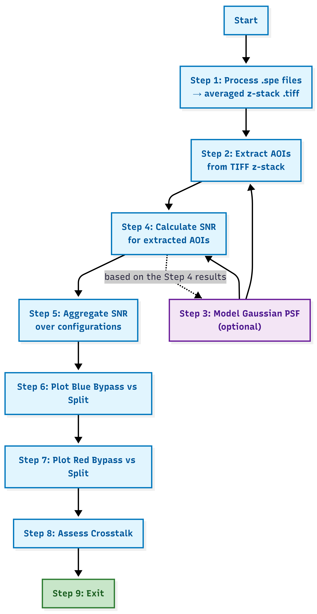

# Per-Spot SNR Benchmark Suite

This Python-based suite provides a standardized framework for benchmarking the performance of image-splitter configurations in Single Molecule Localization Microscopy (SMLM). It implements a **Tapqir-inspired per-spot SNR assessment** to compare photon retention and signal quality across different hardware setups.

## Workflow Overview

The pipeline is designed as a sequential command-line interface (CLI) that guides the user from raw data processing to comparative plotting.

  

---

## Features & Methodology

### 1. Experimental PSF Fitting & SNR (Step 4)
The core of this benchmark is the automated characterization of experimental bead data across a z-stack. 
- **Experimental Fitting**: For every AOI and every z-slice, the suite performs a 2D Gaussian fit on the **real bead data** to determine the experimental PSF parameters (amplitude, centroid, and width).
- **Weighted SNR Calculation**: Using the fitted experimental parameters, the code generates a normalized weight map ($w_{ij}$) to calculate the SNR via a weighted least-squares approach (Ordabayev/Tapqir formula):
  $$S = \sum_{ij} w_{ij} (d_{ij} - b)$$
  $$N = \sqrt{\sigma_b^2 + g \cdot b}$$
  $$SNR = \frac{S}{N}$$
  *This ensures the SNR reflects the actual captured signal quality of the experimental PSF.*

### 2. Optional Gaussian PSF Modeling (Step 3)
Users can optionally generate **synthetic Gaussian spots** with known parameters. This acts as a "ground truth" to validate the performance of the fitting algorithm against an ideal, noise-controlled model before applying it to experimental data.

### 3. Dual-Channel Crosstalk & Focus Analysis
- **Crosstalk Assessment**: Calculates leakage between channels ($SNR_{leak} / SNR_{signal}$) and generates spatial maps.
- **Focal Shift Benchmark**: Automatically identifies the "best z-slice" (peak SNR) to measure focal offsets induced by splitter optics.

---

## Project Structure

| File | Description |
| :--- | :--- |
| `main.py` | The central CLI entry point (Steps 1-9). |
| **`snr_calc.py`** | Performs PSF fitting and calculates SNR for both **3D experimental z-stacks** and **2D Gaussian spot models**. |
| `gaussian_spot_model.py` | Generates "Ideal" synthetic PSF spots for benchmarking against real data. |
| `tiff_aoi_extractor.py` | Extracts $50 \times 50$ px Areas of Interest (AOIs) and computes background/offset statistics. |
| `assess_crosstalk.py` | Calculates and plots signal leakage between red and blue channels. |
| `analyze_config.py` | Aggregates results across multiple FOV positions (pos1, pos2, etc.). |

---

## Usage Instructions

### Step 1: Data Preparation
Run `main.py` and choose **Option 1** to convert your raw `.spe` camera files into an averaged `.tiff` z-stack.

### Step 2: Extraction & Fitting
- **Option 2**: Provide bead coordinates to extract AOIs.
- **Option 4**: Run the SNR calculation. The script will perform a 2D Gaussian fit on every bead in every z-slice to determine optimal weights.

### Step 3: Aggregation & Comparative Plotting
Once individual positions (pos1, pos2, etc.) are processed for your configurations (e.g., `bypass_blue` and `split_blue`), use **Options 5-8** to generate comparative results:

- **Option 5 (Aggregate SNR)**: Processes the `.npy` results from all FOV positions and generates summary `.csv` tables (`config_per_pos.csv`, `config_per_AOI.csv`). **This step must be completed before plotting.**
- **Options 6 & 7 (Plotting)**: Generates comparative figures between configurations:
  - **Efficiency Ratios**: $SNR_{split} / SNR_{bypass}$.
  - **Global Retention**: Percentage of signal preserved through the splitter.
  - **Focal Shift**: Automatic measurement of axial focus offsets.
- **Option 8 (Assess Crosstalk)**: Specifically for dual-channel splitters, this calculates and maps signal leakage ($SNR_{leak} / SNR_{signal}$) across the sensor.
- **Option 9**: Safely exits the pipeline.
---

## Academic Credit

This software was developed as part of the following Master's Thesis:

**Title:** *AUTOMATED COMPUTATIONAL CHARACTERIZATION OF ABERRATIONS IN FLUORESCENCE MICROSCOPY: A COMPARATIVE ANALYSIS*  
**Author:** Aleksandra Will  
**Institution:** IMC Hochschule für Angewandte Wissenschaften Krems (University of Applied Sciences)  
**Submitted:** 15.03.2026

### Acknowledgements
Portions of the SNR and Gaussian modeling logic are adapted from the [Tapqir project](https://github.com/johannabertl/tapqir) (Copyright Contributors to the Tapqir project, Apache-2.0 License).
